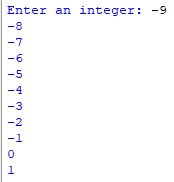
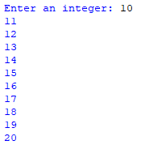

## Description 
This program takes a user input, which is a number, and then prints the next ten numbers starting from that input using a for loop. It also includes additional examples of alternative loop structures, such as while and while True loops, as commented sections.
## Example
♡ Example 1    
  
♡ Example 2    

